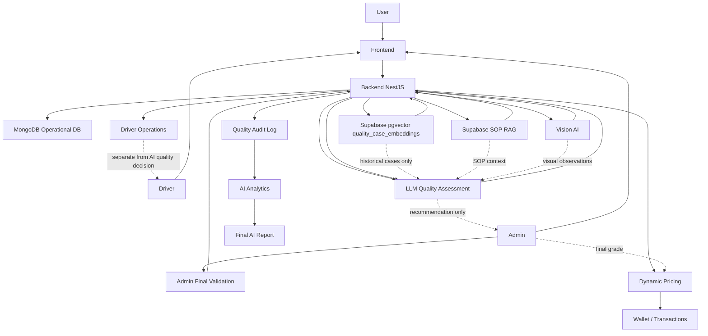

# AI Architecture Diagram

## Diagram Notes

- User uploads waste submission through the frontend.
- Admin runs AI Quality Check from the verification flow.
- Backend calls Vision AI for visual observation.
- Backend retrieves SOP context from Supabase RAG.
- Backend retrieves similar historical quality cases from Supabase pgvector.
- LLM recommends grade and confidence.
- Admin finalizes grade manually.
- Dynamic Pricing calculates payout from final admin grade.
- Audit log feeds analytics and final AI report.
- Driver operations are separate from the AI quality decision.

