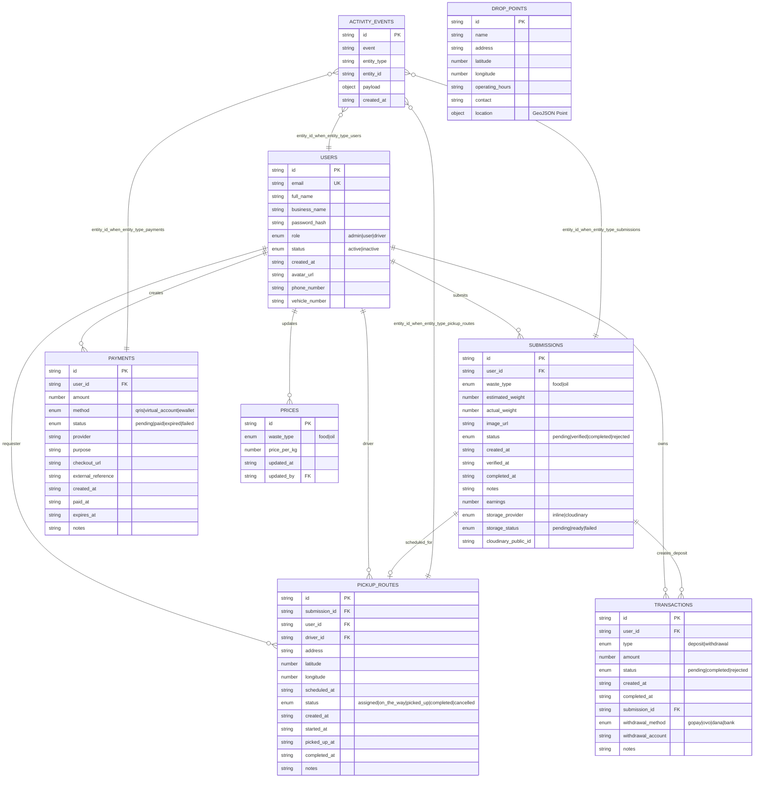

# CuanLimbah NoSQL ERD

Dokumen ini memakai ERD logical untuk MongoDB. Relasi tidak dienforce sebagai foreign key oleh database; relasi dijaga oleh aplikasi memakai field ID string seperti `user_id`, `driver_id`, dan `submission_id`.

## Diagram

## Relasi Logical

| Dari koleksi | Field | Ke koleksi | Field target | Kardinalitas |
| --- | --- | --- | --- | --- |
| `submissions` | `user_id` | `users` | `id` | many-to-one |
| `transactions` | `user_id` | `users` | `id` | many-to-one |
| `transactions` | `submission_id` | `submissions` | `id` | many-to-one, optional |
| `payments` | `user_id` | `users` | `id` | many-to-one |
| `pickup_routes` | `submission_id` | `submissions` | `id` | one-to-one logical |
| `pickup_routes` | `user_id` | `users` | `id` | many-to-one requester |
| `pickup_routes` | `driver_id` | `users` | `id` | many-to-one driver, `users.role=driver` |
| `prices` | `updated_by` | `users` | `id` | many-to-one admin/user updater |
| `activity_events` | `entity_id` | polymorphic | `id` | depends on `entity_type` |

## Indexes Dari Schema

| Koleksi | Index / unique |
| --- | --- |
| `users` | `id` unique, `email` unique |
| `submissions` | `id` unique, `user_id`, `waste_type`, `status`, `created_at` |
| `pickup_routes` | `id` unique, `submission_id`, `user_id`, `driver_id`, `scheduled_at`, `status`, `created_at` |
| `transactions` | `id` unique, `user_id`, `type`, `status`, `created_at` |
| `payments` | `id` unique, `user_id`, `status`, `created_at` |
| `prices` | `id` unique, `waste_type` unique |
| `drop_points` | `id` unique, `name`, `location` 2dsphere |
| `activity_events` | `id` unique, `event`, `entity_type`, `entity_id`, `created_at` |

## Catatan NoSQL

- Primary key aplikasi memakai field `id`, bukan `_id` MongoDB.
- Field dengan suffix `_id` adalah reference logical antar collection.
- Data user biasa, admin, dan driver disimpan dalam collection yang sama: `users`, dibedakan oleh field `role`.
- `drop_points` saat ini berdiri sendiri dan dipakai untuk pencarian lokasi; belum ada reference langsung dari collection lain.
- `activity_events` adalah audit/event log polymorphic: `entity_type` menentukan collection target, `entity_id` menentukan dokumen target.
